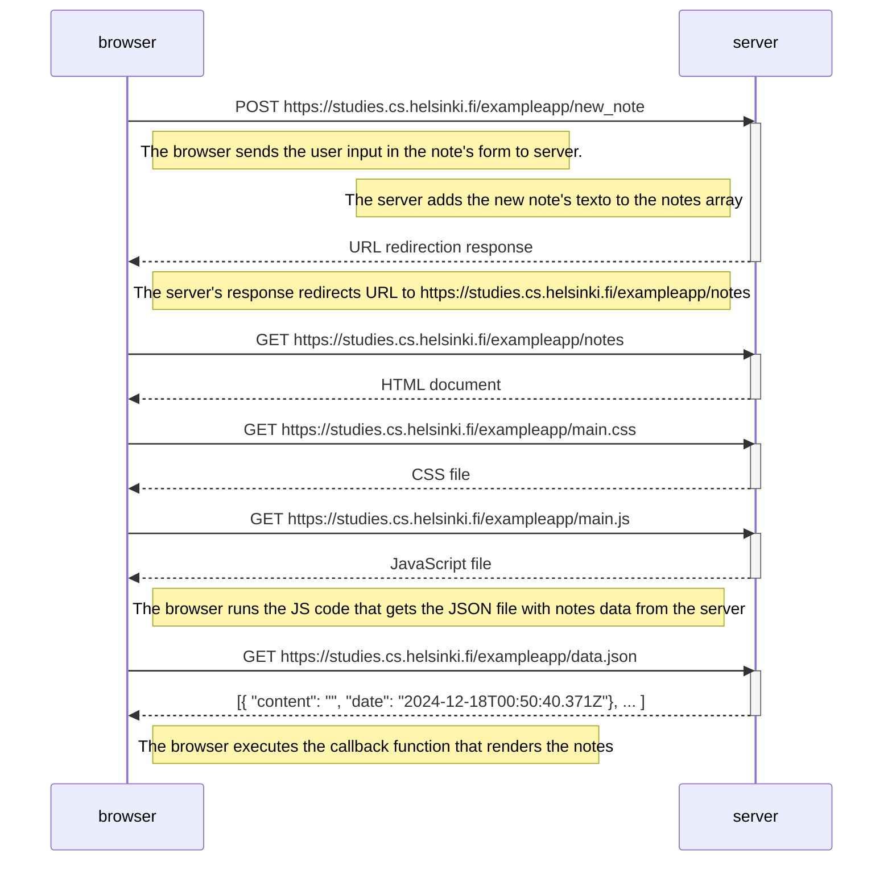

```mermaid
sequenceDiagram
participant browser
participant server

    browser->>server: POST https://studies.cs.helsinki.fi/exampleapp/new_note
    activate server
    Note right of browser: The browser sends the user input in the note's form to server.
    Note left of server: The server adds the new note's texto to the notes array
    server-->>browser: URL redirection response
    deactivate server
    Note left of server: The server's response redirects URL to https://studies.cs.helsinki.fi/exampleapp/notes        
    browser->>server: GET https://studies.cs.helsinki.fi/exampleapp/notes
    activate server
    server-->>browser: HTML document
    deactivate server
    browser->>server: GET https://studies.cs.helsinki.fi/exampleapp/main.css
    activate server
    server-->>browser: CSS file
    deactivate server
    browser->>server: GET https://studies.cs.helsinki.fi/exampleapp/main.js
    activate server
    server-->>browser: JavaScript file
    deactivate server
    Note right of browser: The browser runs the JS code that gets the JSON file with notes data from the server
    browser->>server: GET https://studies.cs.helsinki.fi/exampleapp/data.json
    activate server
    server-->>browser: [{ "content": "", "date": "2024-12-18T00:50:40.371Z"}, ... ]
    deactivate server
    Note right of browser: The browser executes the callback function that renders the notes
```