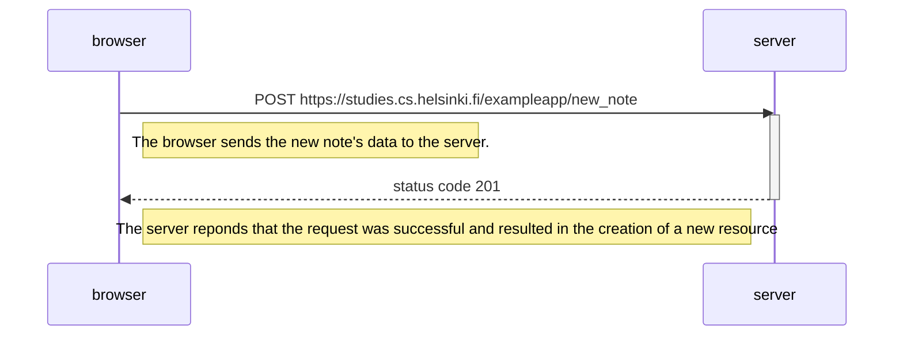

```mermaid
sequenceDiagram
participant browser
participant server

    browser->>server: POST https://studies.cs.helsinki.fi/exampleapp/new_note
    activate server
    Note right of browser: The browser sends the new note's data to the server.
    server-->>browser: status code 201
    deactivate server
    Note left of server: The server reponds that the request was successful and resulted in the creation of a new resource    
```